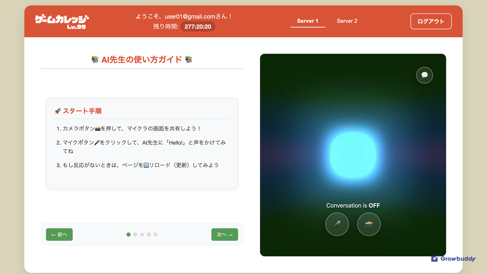
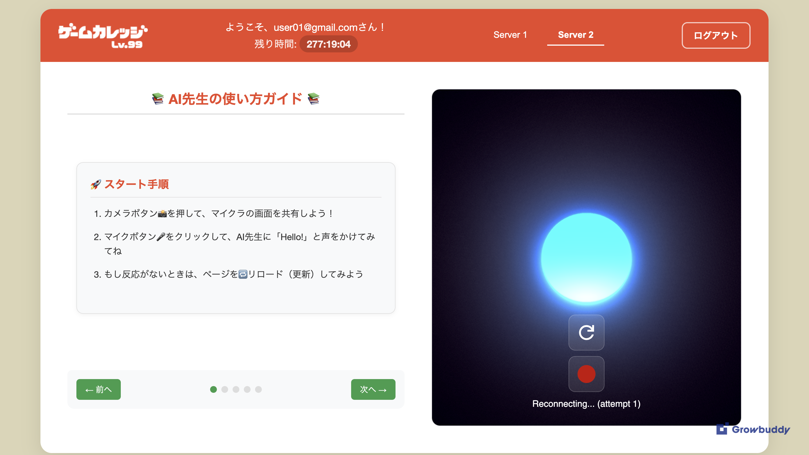

# 🧠 AI Sensei

## Overview

**AI Sensei** is an innovative educational platform designed to help Japanese children learn English through interactive gaming experiences.  
The platform features two AI tutors powered by different technologies:

- **Server 1:** Powered by OpenAI  
- **Server 2:** Powered by Gemini AI  

By combining real-time screen analysis with live AI conversations, AI Sensei creates an immersive environment where children can naturally learn English while playing games.

---

## 🎮 Key Features

- Real-time screen analysis and interactive responses  
- Live AI conversations (voice and text)  
- Dual AI architecture: Gemini × OpenAI  
- Game-integrated English learning experience  
- Specially designed for Japanese learners  

---

## 🌐 Access

**Live Platform:**  
👉 [https://ai-sensei-8849b.web.app/](https://ai-sensei-8849b.web.app/)

For platform access inquiries, please contact:  
📩 **lylac.bsn@gmail.com**

---

## 🖼 Screenshots

### 💻 Server 1 (OpenAI)

### 🤖 Server 2 (Gemini)

---

## 🔗 Integration Possibilities

AI Sensei’s **real-time screen analysis** and **conversational AI** capabilities open up a wide range of integration opportunities across different domains.

### 🎓 Educational Applications
- **Programming Tutoring:** Step-by-step coding assistance within the user’s IDE/editor  
- **Math Problem Solving:** Real-time help with equations and problem-solving  
- **Language Learning:** Interactive conversation for any language  
- **Science Experiments:** Guiding students through virtual lab simulations  
- **Art & Design:** Providing instant feedback on digital art creation  

### 💼 Professional / Technical Applications
- **Error Debugging:** “Look at my screen and help me fix this” — instant troubleshooting  
- **Software Training:** Teaching employees how to use new software tools  
- **Code Review:** Real-time feedback on code quality and improvements  
- **Data Analysis:** Assistance with spreadsheets or database operations  
- **System Administration:** Supporting configuration and troubleshooting tasks  

### 🎨 Creative / Productivity Applications
- **Game Development:** Guidance on game design, level creation, or debugging  
- **Content Creation:** Help with video editing, design, or writing workflows  
- **Project Management:** Assistance with planning tools and workflows  
- **Financial Analysis:** Support for trading platforms and financial modeling  
- **Research Assistance:** Navigation of academic databases and tools  

### ♿️ Accessibility / Support Applications
- **Accessibility Training:** Teaching the use of assistive technologies  
- **Remote Support:** Real-time IT helpdesk and troubleshooting  
- **Onboarding:** New employee training for internal software systems  
- **Customer Support:** Assisting users in navigating complex tools  
- **Healthcare Training:** Supporting medical professionals in software use  

---

## ⚙️ Technical Foundation

With its **dual AI architecture (Gemini & OpenAI)**, AI Sensei delivers stable and flexible performance across diverse use cases.  
Its real-time screen reading and live interaction capabilities make it highly adaptable for any scenario that benefits from **live, guided AI assistance**.

---

*AI Sensei — Making English learning fun, engaging, and interactive through the power of gaming and AI.* 🎮✨

# 🧠 AI Sensei（日本語版）

## 概要

**AI Sensei**は、インタラクティブなゲーム体験を通じて、日本の子どもたちが楽しく英語を学べるように設計された革新的な教育プラットフォームです。  
このプラットフォームには、異なる技術で動作する2種類のAIチューターが搭載されています：

- **サーバー1:** OpenAI 搭載  
- **サーバー2:** Gemini AI 搭載  

リアルタイムで画面を解析しながらAIと会話できるため、子どもたちはまるでAIと一緒に遊んでいるような感覚で英語を学ぶことができます。

---

## 🎮 主な機能

- リアルタイム画面解析とインタラクティブな応答  
- 音声・テキストによるライブAI会話  
- Gemini × OpenAI のデュアルAIアーキテクチャ  
- ゲームと連動した英語学習体験  
- 日本の子どもたちの学習スタイルに合わせた特別設計  

---

## 🌐 アクセス

**ライブ版プラットフォーム:**  
👉 [https://ai-sensei-8849b.web.app/](https://ai-sensei-8849b.web.app/)

プラットフォームのアクセスをご希望の方は、以下までご連絡ください：  
📩 **lylac.bsn@gmail.com**

---

## 🖼 スクリーンショット

### 💻 サーバー1（OpenAI版）

### 🤖 サーバー2（Gemini版）

---

## 🔗 さまざまな分野への応用可能性

AI Senseiの**リアルタイム画面解析**と**会話型AI**の技術は、教育だけでなく多様な分野への応用が可能です。

### 🎓 教育分野
- **プログラミング指導**：コードエディタを見ながらステップごとの指導  
- **数学サポート**：方程式や問題のリアルタイム解説  
- **語学学習**：あらゆる言語に対応した会話練習  
- **科学実験支援**：バーチャルラボでの実験解説  
- **アート・デザイン**：作品制作へのフィードバック  

### 💼 プロフェッショナル／技術分野
- **エラーデバッグ支援**：「このエラーの直し方を教えて」と言うだけで即アドバイス  
- **ソフトウェア研修**：新しいツールの操作をリアルタイムで指導  
- **コードレビュー**：品質チェックと改善提案を即時提示  
- **データ分析**：スプレッドシート操作や分析をサポート  
- **システム運用**：サーバー設定やトラブル対応を支援  

### 🎨 クリエイティブ／生産性分野
- **ゲーム開発支援**：レベル設計やデバッグをサポート  
- **コンテンツ制作**：動画編集やライティングをAIが補助  
- **プロジェクト管理**：効率的なワークフロー設計を支援  
- **財務分析**：トレーディングやモデリングの支援  
- **研究支援**：学術データやリサーチツールのナビゲート  

### ♿️ アクセシビリティ・サポート分野
- **支援技術のトレーニング**：ユーザーへの使い方指導  
- **リモートサポート**：ITヘルプデスクや遠隔支援  
- **オンボーディング**：新入社員への業務システム研修  
- **カスタマーサポート**：複雑なアプリの操作ナビゲーション  
- **医療研修**：専門家向け医療システムの操作支援  

---

## ⚙️ 技術基盤

GeminiとOpenAIの**デュアルAI構成**により、さまざまなユースケースで安定した性能を発揮。  
さらにリアルタイム画面解析機能によって、どの分野でも「ライブで導くAIアシスタント」として活用することが可能です。

---

*AI Sensei — ゲームとAIの力で、子どもたちの英語学習をもっと楽しく、もっとインタラクティブに。* 🎮✨
